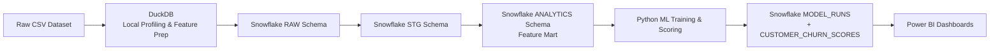
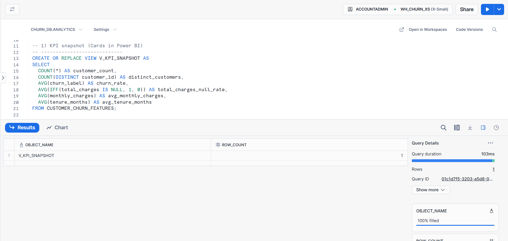
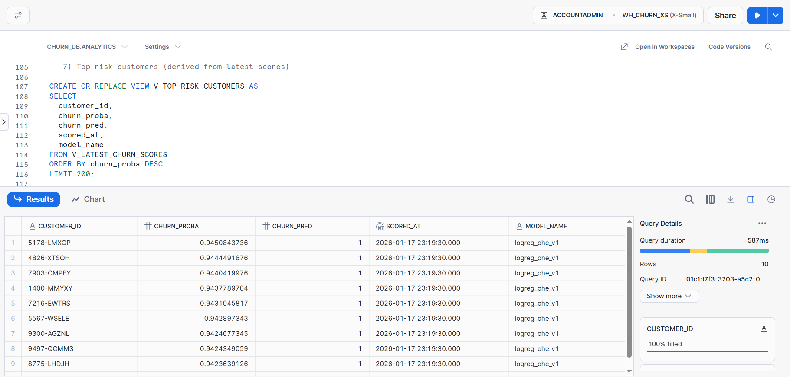
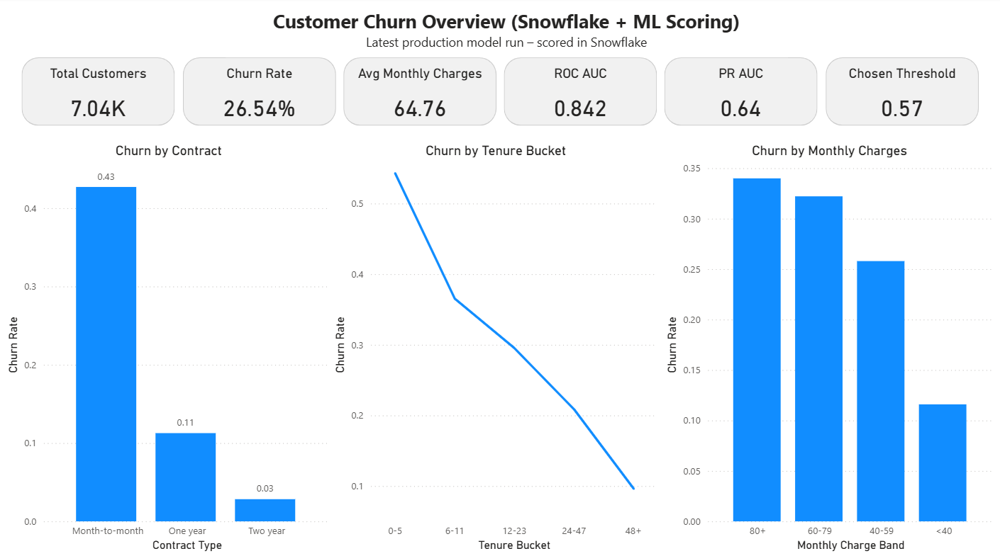
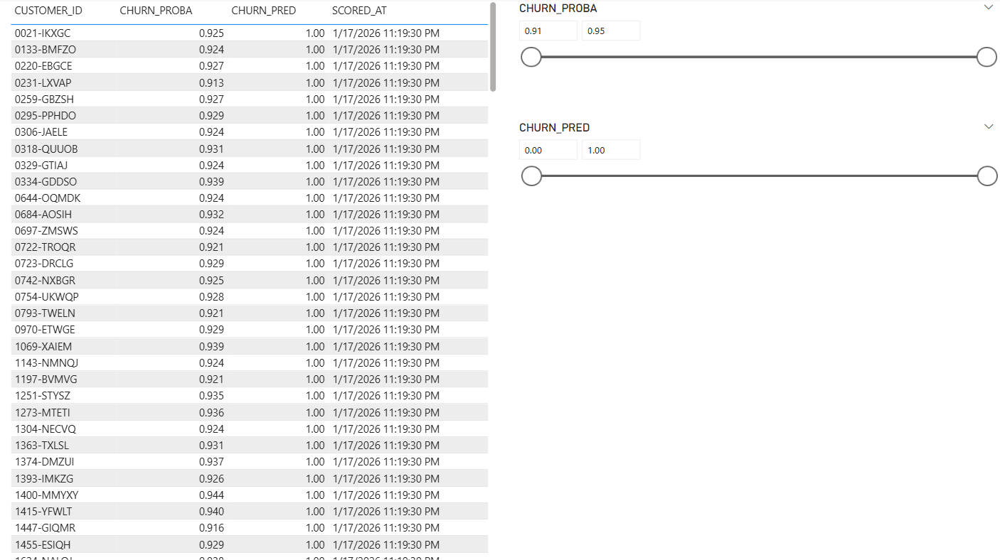

# Customer Churn Analytics & ML Scoring Platform  
**Snowflake · Python · Power BI · AWS**

An end-to-end customer churn analytics platform that mirrors real-world data science and analytics engineering workflows.  
The system ingests raw data, performs warehouse-native transformations, trains and scores an ML model, and delivers executive and operational dashboards in Power BI.

---

## Business Problem

Customer churn directly impacts revenue.  
This project enables stakeholders to:
- Understand **who is churning and why**
- Quantify churn drivers (contract, tenure, pricing)
- Identify **high-risk customers** using ML probability scores
- Act using BI dashboards backed by warehouse-native logic

---

## Architecture Overview

### End-to-End Data Flow


### AWS Context (Production-Realistic)

*   Snowflake account is deployed on **AWS**
    
*   All warehouse compute and storage operate on AWS infrastructure
    
*   Pipeline design mirrors common AWS architectures:
    
    *   Optional **AWS S3 landing zone** for raw file ingestion
        
    *   Snowflake external stages for cloud-native loading
        
    *   Transformations and analytics remain warehouse-first
        

Tech Stack
----------

**Data & Processing**

*   Python 3.13
    
*   DuckDB (local SQL profiling & validation)
    
*   Pandas, NumPy
    

**Data Warehouse**

*   Snowflake (RAW → STG → ANALYTICS schemas)
    
*   Warehouse-native quality checks
    
*   BI-ready semantic views
    

**Machine Learning**

*   scikit-learn pipeline
    
*   Logistic Regression
    
*   Metrics tracked:
    
    *   ROC AUC
        
    *   PR AUC
        
    *   Optimized decision threshold
        

**Business Intelligence**

*   Power BI (direct connection to Snowflake)
    
*   Executive + operational dashboards
    

**Cloud Platform**

*   AWS (Snowflake-hosted deployment)
    
*   Optional S3-based ingestion pattern
    

Data Model (Snowflake)
----------------------

### Core Tables

*   `ANALYTICS.CUSTOMER\_CHURN\_FEATURES`
    
*   `ANALYTICS.CUSTOMER\_CHURN\_SCORES`
    
*   `ANALYTICS.MODEL\_RUNS`
    

### BI Views

*   `V\_KPI\_SNAPSHOT`
    
*   `V\_CHURN\_BY\_CONTRACT`
    
*   `V\_CHURN\_BY\_TENURE\_BUCKET`
    
*   `V\_CHURN\_BY\_MONTHLY\_CHARGE\_BAND`
    
*   `V\_LATEST\_CHURN\_SCORES`
    
*   `V\_TOP\_RISK\_CUSTOMERS`
    

These views provide a clean semantic layer for Power BI without duplicating logic.

Machine Learning Workflow
-------------------------

1.  Feature extraction from Snowflake analytics schema
    
2.  Train / test split
    
3.  Pipeline:
    
    *   Imputation
        
    *   One-hot encoding
        
    *   Logistic regression
        
4.  Threshold optimization using PR/F1 tradeoff
    
5.  Write-back to Snowflake:
    
    *   Model metadata
        
    *   Per-customer churn probabilities
        

**Example performance**

*   ROC AUC ≈ 0.84
    
*   PR AUC ≈ 0.64
    
*   Optimized threshold ≈ 0.57
    

Power BI Dashboards
-------------------

### Page 1 — Executive Overview

*   Total Customers
    
*   Churn Rate
    
*   Avg Monthly Charges
    
*   ROC AUC, PR AUC
    
*   Decision Threshold
    
*   Churn by:
    
    *   Contract Type
        
    *   Tenure Bucket
        
    *   Monthly Charge Band
        

### Page 2 — Risk Targeting

*   High-risk customer table
    
*   Churn probability slicer
    
*   Binary churn prediction filter
    
*   Latest model run only
    

## Screenshots

### Snowflake – KPI Semantic Layer


**Snowflake – KPI Snapshot View**  
Single-row KPI view used as the semantic source for executive Power BI cards.

### Snowflake – Operational Risk Output


**Snowflake – Top Risk Customers View**  
Warehouse-derived view showing highest-risk customers from the latest ML scoring run, used directly by Power BI for operational targeting.

### Power BI – Executive Overview


**Power BI – Executive Churn Overview**  
Executive-facing dashboard summarizing customer churn KPIs, key churn drivers, and model performance metrics, powered by Snowflake analytics views and the latest ML scoring run.

### Power BI – Risk Targeting View


**Power BI – Customer Risk Targeting View**  
Operational dashboard enabling exploration of high-risk customers using churn probability scores, prediction flags, and interactive filters, sourced directly from Snowflake warehouse outputs.


Repository Structure
--------------------

snowflake-churn-warehouse/\
│\
├── src/\
│   ├── config.py\
│   ├── snowflake_client.py\
│   ├── load_to_snowflake.py\
│   ├── run_quality_checks.py\
│   └── model_train_score.py\
│\
├── sql/\
│   ├── 08_scoring_tables.sql\
│   └── 09_bi_views.sql\
│\
├── data/\
│   └── telco_churn.csv\
│\
├── powerbi/\
│   └── churn_dashboard.pbix\
│\
├── run_local_duckdb.py\
├── requirements.txt\
├── .env.example\
└── README.md

How to Run Locally (No Secrets Exposed)
---------------------------------------

### 1\. Clone the repository

```bash
git clone https://github.com/your-username/snowflake-churn-warehouse.git
cd snowflake-churn-warehouse
```

### 2\. Create virtual environment

```bash
python -m venv .venv
source .venv/Scripts/activate  # Windows Git Bash
pip install -r requirements.txt
```

### 3\. Configure environment variables

Secrets are **never committed**.

```bash
cp .env.example .env
```

Fill in your Snowflake credentials inside .env.

`.env` is excluded via `.gitignore`.

### 4\. Run local profiling (DuckDB)

```bash
python run_local_duckdb.py
```

Validates:

*   delimiter detection
    
*   numeric parsing
    
*   churn distribution
    
*   feature logic
    

### 5\. Load data into Snowflake

```bash
python -m src.load_to_snowflake
```

Creates:

*   RAW → STG → ANALYTICS schemas
    
*   Feature mart
    

### 6\. Run warehouse-native quality checks

```bash
python -m src.run_quality_checks
```

Includes:

*   uniqueness checks
    
*   null checks
    
*   label distribution
    
*   parsing health
    

### 7\. Train model and write scores

```bash
python -m src.model_train_score
```

Outputs:

*   `MODEL\_RUNS`
    
*   `CUSTOMER\_CHURN\_SCORES`
    

### 8\. Open Power BI

*   Connect to Snowflake
    
*   Import BI views
    
*   Load dashboard (`.pbix`)
    

Security Notes
--------------

*   No credentials in source code
    
*   `.env` file is gitignored
    
*   Snowflake authentication handled via environment variables
    
*   Suitable for public GitHub hosting
